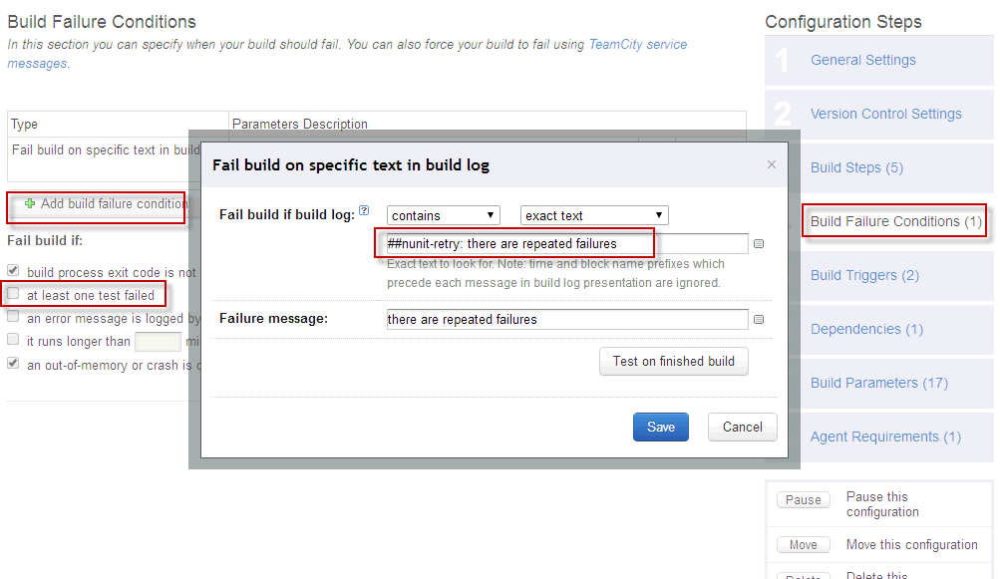

NUnit-retry
===========

A NUnit plugin that retries intermittently failing tests.

Why?
----

Maybe you have an automated regression test suite. As part of that suite you have tests dependent on external libraries, consuming remote resources or running under unreliable tools.
Then you have a continuous integration server running this test suite and it's always failing because of some intermittently failing tests.
The goal of this plugin is to ensure that tests are passing at least X times out of N tries – thus hedging against intermittently failing components of the suite.

What you must consider
----------------------

Martin Fowler described very well [in an article](http://martinfowler.com/articles/nonDeterminism.html) why non-deterministic tests are bad and why you should get rid of them.
This library is not intended to bypass these recommandations but help you manage your quarantined tests.
You must be aware that by using this library, you are not testing the entire process anymore but are rather testing for specific functionnality scenarios.

Installation
------------
- Copy nunit-retry.dll inside your NUnit 2.6.3 addins folder.
- Add a reference to nunit-retry.dll to your project. The project is available on NuGet (Install-Package NUnit-retry)

How to use it
-------------

Just use the RetryAttribute on a TestMethod or a test fixture:
``` c#
        
        private static int run = 0;
        
        ...
        
        [Test]
        [Retry(Times = 3, RequiredPassCount = 2)]
        public void One_Failure_On_Three_Should_Pass()
        {
            run++;

            if (run == 1)
            {
                Assert.Fail();
            }

            Assert.Pass();
        }
```

Additional info
------------

NUnit has some problems with using plugins (addins), which are compiled with references to different NUnit libraries versions.
You can use this plugin not only with NUnit 2.6.3, but please re-compile it with the references to appropriate NUnit libraries version.

There testrunner-proxy as part of solution. Avoid its using, because it removes all messages sent by nunit-runner to teamcity about failures for tests, which are passed successfully after retried attempt - you always should know, that there were failures. 

What I've added
------------

Original NUnit-retry plugin doesn't support Explicit, Ignore and Category attributes - FIXED. 
In case of retired failure, message will be sent by addin: "##nunit-retry: there are repeated failures". This message can be handled by TeamCity to set build status to 'FAILED' only if there repeated failures.
To use this feature you should disable "at least one test failed" failure condition and add custom one (this is made for build-step, where test-runner is started):



NUnit-retry
===========

Плагин для NUnit для повторного запуска упавших тестов.

Установка
------------

- Скопируется nunit-retry.dll в папку addins для NUnit 2.6.3.
- Добавьте ссылку на nunit-retry.dll в свой проект. Данный проект доступен так же при помощи NuGet (Install-Package NUnit-retry)

Как использовать
-------------

Просто используйте RetryAttribute для тестового метода или класса (TestMethod or a test fixture):
``` c#
        
        private static int run = 0;
        
        ...
        
        [Test]
        [Retry(Times = 3, RequiredPassCount = 2)]
        public void One_Failure_On_Three_Should_Pass()
        {
            run++;

            if (run == 1)
            {
                Assert.Fail();
            }

            Assert.Pass();
        }
```

Дополнительная информация
-------------

NUnit имеет проблемы при использовании расширений (addins), если они были скомпилированы под отличающуюся версию библиотек.
Данный плагин может использоваться и с другими версиями NUnit, но для этого он должен быть перекомпилирован со ссылками на библиотеки соответствующей версии NUnit. Скачайте, замените референсы (ссылки) на библиотеки нужной версии и перекомпилируйте.

В составе солюшна также имеется обертка для nunit-runner (TeamCity.NUnit.TestRunner.Proxy.Retry). Предостерегаю от ее использования: работа данной обертки заключается в том, что она вырезает из сообщений NUnit-runner-а для teamcity сообщения о падении тестов, которые "поднялись". Что далеко не всегда уместно - об ошибках надо знать. Кроме того, данный функционал может не всегда корректно работать, насколько я понял из исходного кода и анализа сообщений.

Что было добавлено мной
-------------

Исходная версия NUnit-retry не поддерживает атрибуты Explicit, Ignore и Category - это было исправлено. 
Кроме того, в случае повторного падения тест-кейса аддон пошлет сообщение "##nunit-retry: there are repeated failures", которое может быть обработано TeamCity. Чтобы TeacmCity в этом случае правильно работал, надо его настроить, убрав Failure condition при падении любого теста и добавить свой Failure condition для соответствующего билд-степа (в котором запускаются тесты):

